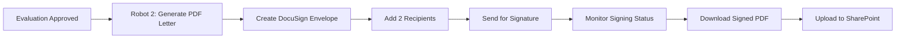

# DocuSign Integration for A006 Provider Evaluation Letters

## Tổng quan (Overview)

Sau khi evaluation được approve bởi Jefe de Área, hệ thống cần tạo PDF letter đánh giá và thu thập chữ ký điện tử từ:
1. **Responsable Técnico** (người đánh giá chính)
2. **Jefe de Área** (người phê duyệt)

Document này phân tích **2 phương án** tích hợp DocuSign để thực hiện quy trình ký số này.

---

## 🔄 Workflow Context



**Trigger**: Khi `aprobada = true` trong SharePoint list `ongoingEvaluations`

**Output**: Signed PDF letter uploaded vào SharePoint với URL lưu trong cột `url_carta_firmada`

---

## 📊 So sánh 2 Options

| Tiêu chí | Option 1: Power Automate | Option 2: UiPath Robot |
|----------|--------------------------|------------------------|
| **Trigger** | SharePoint item modified | Orchestrator Queue/Scheduled |
| **Complexity** | ⭐⭐ Medium | ⭐⭐⭐ High |
| **Licensing** | Standard (included) | UiPath license + Integration Service |
| **Maintenance** | ⭐⭐⭐ Easy | ⭐⭐ Medium |
| **Flexibility** | ⭐⭐ Limited | ⭐⭐⭐ High |
| **Error Handling** | ⭐⭐ Basic retry | ⭐⭐⭐ Advanced REFramework |
| **Integration với現project** | Native với Power Platform | Đã có Robot 2 |
| **Real-time monitoring** | ❌ Polling needed | ✅ Long-running workflows |
| **Template management** | Via DocuSign portal | Via API + templates |

---

## 🔷 OPTION 1: Power Automate + DocuSign Connector

### ✅ Ưu điểm

1. **Native Integration**: DocuSign connector là Standard tier, không cần license thêm
2. **Low-code**: Dễ config, không cần developer skills mạnh
3. **Seamless với Power Platform**: Dễ trigger từ Power App hoặc SharePoint
4. **Quick setup**: Có thể deploy trong 1-2 ngày
5. **Maintenance đơn giản**: Non-technical users có thể maintain

### ⚠️ Nhược điểm

1. **Limited control**: Ít flexibility trong custom logic phức tạp
2. **Polling for status**: Cần check status định kỳ (không real-time)
3. **Error handling cơ bản**: Không có framework như REFramework
4. **Dependency**: Phụ thuộc vào Power Automate service availability

---

### 🏗️ Architecture - Power Automate

#### **Flow 1: Create and Send DocuSign Envelope**

**Trigger**: SharePoint - When an item is created or modified
- List: `ongoingEvaluations`
- Condition: `aprobada = true` AND `url_carta_firmada` is empty

**Steps**:

1. **Get evaluation data** từ SharePoint item
   - nombre_proveedor, documento_compras, puntaje_total, etc.

2. **Compose HTML template** cho letter
   - Sử dụng Compose action với HTML template
   - Inject dynamic data từ SharePoint

3. **Generate PDF** từ HTML
   - Action: **HTML to PDF** (Premium connector - cần check license)
   - Hoặc: **Word Online** → Create document from template → Convert to PDF

4. **Create DocuSign Envelope**
   - Connector: DocuSign
   - Action: **Create and send envelope**
   - **Parameters**:
     ```
     Template: [Template ID hoặc upload document trực tiếp]
     Recipients:
       - Recipient 1: email_responsable_tecnico (Signer)
       - Recipient 2: email_jefe_area (Signer)
     Email Subject: "Firma requerida - Carta de Evaluación - {proveedor}"
     Email Message: "Por favor firme la carta de evaluación adjunta"
     ```

5. **Update SharePoint item**
   - Lưu Envelope ID vào SharePoint (column mới: `docusign_envelope_id`)
   - Set flag: `envelope_sent = true`

**Output**: Envelope được tạo và sent, recipients nhận email từ DocuSign

---

#### **Flow 2: Monitor Signing Status and Download Signed Document**

**Trigger**: Recurrence (chạy mỗi 30 phút hoặc 1 giờ)

**Steps**:

1. **Get items từ SharePoint**
   - Filter: `envelope_sent = true` AND `url_carta_firmada` is empty

2. **For each item**:
   
   a. **Get Envelope Status**
      - Action: DocuSign → **Get envelope**
      - Input: Envelope ID từ SharePoint
   
   b. **Condition: Check if Status = "completed"**
   
   c. **If completed**:
      - **Download signed document**
        - Action: DocuSign → **Get envelope documents**
      
      - **Upload to SharePoint**
        - Action: SharePoint → **Create file**
        - Location: Document library (e.g., `/Cartas Firmadas/`)
        - Filename: `Carta_{documento_compras}_{fecha}.pdf`
      
      - **Update SharePoint item**
        - Set `url_carta_firmada` = URL của file vừa upload
        - Set `firma_responsable_tecnico = true`
        - Set `firma_jefe_area = true`

**Output**: Signed PDF được download và lưu vào SharePoint

---

### 📝 Implementation Details - Power Automate

#### **DocuSign Connector Configuration**

1. **Add DocuSign connection** trong Power Automate
   - Go to Data → Connections → New connection
   - Search "DocuSign" → Add
   - Login với DocuSign account credentials

2. **Get Template ID** (nếu dùng template):
   - Login vào DocuSign web portal
   - Templates → Copy Template ID
   - Paste vào Flow config

#### **HTML to PDF Options**

**Option A: Muhimbi PDF Converter** (Premium)
- Cost: ~$80/month
- Features: Advanced PDF generation, watermarks, etc.

**Option B: Encodian** (Premium)
- Cost: ~$50-100/month
- Features: HTML to PDF, merge documents

**Option C: Custom Azure Function** (Free-tier possible)
- Deploy Azure Function với library như Puppeteer
- Power Automate gọi HTTP endpoint
- Free trong limits của Azure

**Option D: Word Online (Included)**
- Create Word document from template
- Use built-in "Convert to PDF" action
- **RECOMMENDED** nếu letter format đơn giản

---

### 🔧 Sample Flow Configuration

#### **Action: Create and send envelope (DocuSign)**

```json
{
  "emailSubject": "Firma requerida - Carta de Evaluación - @{triggerOutputs()?['body/nombre_proveedor']}",
  "emailMessage": "Estimado/a, por favor firme la carta de evaluación adjunta para el proveedor @{triggerOutputs()?['body/nombre_proveedor']}.",
  "documents": [
    {
      "documentBase64": "@{base64(outputs('Generate_PDF'))}",
      "documentId": "1",
      "fileExtension": "pdf",
      "name": "Carta_Evaluacion_@{triggerOutputs()?['body/documento_compras']}.pdf"
    }
  ],
  "recipients": {
    "signers": [
      {
        "email": "@{triggerOutputs()?['body/email_responsable_tecnico']}",
        "name": "@{triggerOutputs()?['body/nombre_responsable_tecnico']}",
        "recipientId": "1",
        "routingOrder": "1"
      },
      {
        "email": "@{triggerOutputs()?['body/email_jefe_area']}",
        "name": "@{triggerOutputs()?['body/nombre_jefe_area']}",
        "recipientId": "2",
        "routingOrder": "2"
      }
    ]
  },
  "status": "sent"
}
```

---

## 🤖 OPTION 2: UiPath Robot + DocuSign Integration Service

### ✅ Ưu điểm

1. **Advanced control**: Full control qua code, complex logic dễ implement
2. **REFramework**: Robust error handling, retry mechanism, logging
3. **Event-driven**: Có thể dùng long-running workflows để monitor real-time
4. **Đã có sẵn Robot 2**: Tích hợp vào workflow hiện tại
5. **Template flexibility**: Dễ manage templates qua API
6. **Scalability**: Dễ scale khi volume tăng

### ⚠️ Nhược điểm

1. **Higher complexity**: Cần UiPath developer skills
2. **License cost**: Cần Integration Service license (~$50/month/user)
3. **Longer setup time**: 3-5 ngày development + testing
4. **Maintenance overhead**: Cần UiPath knowledge để maintain
5. **Infrastructure**: Cần Orchestrator running

---

### 🏗️ Architecture - UiPath Robot

#### **Integration với Robot 2 Workflow**

Robot 2 hiện tại đã có workflow:
1. Trigger khi `aprobada = true`
2. Generate CSV file
3. Generate Carta (Word/PDF)
4. Upload to SharePoint

**→ Thêm step mới**: Send to DocuSign for signature

---

### 📦 UiPath Implementation Components

#### **1. Setup Integration Service Connector**

**Prerequisites**:
- DocuSign account (Admin access)
- UiPath Integration Service license
- Account ID, Integration Key, Secret Key

**Steps** (trong Orchestrator):
1. Go to **Integration Service** → Connectors
2. Add **DocuSign** connector
3. Configure OAuth 2.0:
   - **Account ID**: Lấy từ DocuSign Settings
   - **Integration Key**: Tạo trong DocuSign Apps & Keys
   - **Secret Key**: Copy từ DocuSign
   - **Email**: DocuSign admin email
4. Test connection

---

#### **2. Create DocuSign Template** (One-time setup)

**In DocuSign Portal**:
1. Templates → Create Template
2. Upload blank PDF hoặc Word template
3. Add **2 Signature fields**:
   - Role 1: "Responsable Técnico"
   - Role 2: "Jefe de Área"
4. Add **Date fields** next to signatures
5. Save template → Copy **Template ID**

**Template variables** (nếu cần dynamic content):
- `{{nombre_proveedor}}`
- `{{documento_compras}}`
- `{{puntaje_total}}`
- etc.

---

#### **3. Robot Workflow - Sequence**

**Main.xaml** (REFramework):

```
InitAllSettings
  └─ Load DocuSign config (Template ID, Account ID)

GetTransactionData
  └─ Get items from SharePoint where aprobada = true

Process Transaction
  ├─ Generate PDF Letter (existing)
  ├─ Create DocuSign Envelope ⬅️ NEW
  │   └─ Use: Create Envelope Using Template activity
  ├─ Add PDF to Envelope ⬅️ NEW
  │   └─ Use: Add Document to Envelope activity
  ├─ Add Recipients ⬅️ NEW
  │   └─ Configure 2 signers
  ├─ Send Envelope ⬅️ NEW
  ├─ Update SharePoint (envelope_id, sent_date)
  └─ [OPTIONAL] Monitor status

[Separate Workflow or Long-Running]
Monitor Signing Status
  └─ Poll every 5-10 minutes
  └─ When status = "completed" → Download signed PDF
```

---

#### **4. Key Activities - Detailed Config**

##### **Activity: Create Envelope Using Template**

**Package**: `UiPath.DocuSign.Activities`

**Properties**:
- **TemplateId**: `"your-template-id-here"` (từ DocuSign)
- **AccountId**: `Config("DocuSign_AccountID")`
- **EmailSubject**: `"Firma requerida - " + in_TransactionItem("nombre_proveedor").ToString`
- **Output**: `out_EnvelopeID` (String variable)

---

##### **Activity: Add Document to Envelope**

**Properties**:
- **EnvelopeId**: `out_EnvelopeID`
- **DocumentId**: `"1"`
- **Document**: `IResource` object
  - Convert PDF file path to IResource:
    ```vb
    New FileResource(pdfFilePath)
    ```
- **DocumentName**: `"Carta_Evaluacion_" + documento_compras + ".pdf"`

**⚠️ Note**: Nếu PDF đã được generate trong template, step này có thể skip.

---

##### **Activity: Add Recipient to Envelope** (x2 times)

**Recipient 1: Responsable Técnico**

**Properties**:
- **EnvelopeId**: `out_EnvelopeID`
- **RecipientType**: `Signer`
- **Email**: `in_TransactionItem("email_responsable_tecnico").ToString`
- **Name**: `in_TransactionItem("nombre_responsable_tecnico").ToString`
- **RecipientId**: `"1"`
- **RoutingOrder**: `1` (ký trước)

**Recipient 2: Jefe de Área**

Properties tương tự, nhưng:
- **RecipientId**: `"2"`
- **RoutingOrder**: `2` (ký sau)

---

##### **Activity: Send Envelope**

**Properties**:
- **EnvelopeId**: `out_EnvelopeID`
- **Status**: `"sent"`

---

##### **Activity: Get Envelope** (để check status)

**Properties**:
- **EnvelopeId**: `out_EnvelopeID`
- **Output**: `out_Envelope` (DocuSign.Envelope object)

**Check status**:
```vb
If out_Envelope.Status = "completed" Then
    ' Download signed document
End If
```

---

##### **Activity: Download Documents of Envelope**

**Properties**:
- **EnvelopeId**: `out_EnvelopeID`
- **DocumentId**: `"combined"` (all documents combined)
- **Output**: `out_DocumentBytes` (Byte array)

**Save to file**:
```vb
File.WriteAllBytes(signedPdfPath, out_DocumentBytes)
```

---

#### **5. Error Handling Strategy**

Trong REFramework:

**BusinessRuleException**:
- Missing email addresses
- Invalid template ID
- Recipient not found

**ApplicationException**:
- DocuSign API timeout
- Network error
- Invalid credentials

**Retry Logic**:
```vb
Config("MaxRetryNumber") = 3
Config("RetryInterval") = "00:00:30" ' 30 seconds
```

---

#### **6. Monitoring Signed Status - 2 Options**

**Option A: Polling (Simple)**

Separate workflow chạy theo schedule (mỗi 10 phút):
```
For each envelope in SharePoint where envelope_sent = true AND url_carta_firmada is empty
    Get Envelope status
    If status = "completed"
        Download signed PDF
        Upload to SharePoint
        Update flags
```

**Cons**: Delay 0-10 phút, multiple API calls

**Option B: Long-Running Workflow** (Advanced)

```vb
Do While envelope.Status <> "completed" And envelope.Status <> "declined"
    Delay(TimeSpan.FromMinutes(5))
    envelope = Get Envelope(envelopeID)
Loop

If envelope.Status = "completed" Then
    Download and upload
End If
```

**Cons**: Consumes một robot slot liên tục

---

### 💰 Cost Estimation - UiPath Option

| Item | Cost (Monthly) |
|------|----------------|
| UiPath Integration Service | $50/user |
| DocuSign Account (Business Pro) | $40-65/user |
| Orchestrator (if not already) | Included or $420/month |
| **Total** | **~$90-115/month** |

---

## 🎯 RECOMMENDATION - Phương án đề xuất

### **→ OPTION 1: Power Automate** (RECOMMENDED)

**Lý do:**

✅ **Cost-effective**: Không cần license thêm (DocuSign Standard connector included)  
✅ **Quick deployment**: Setup trong 2-3 ngày  
✅ **Low maintenance**: Dễ maintain bởi team không cần deep technical skills  
✅ **Native integration**: Seamless với Power Platform ecosystem  
✅ **Good enough**: Polling delay 30-60 phút là chấp nhận được cho use case này  

**Khi nào dùng Option 2 (Robot)**:
- Cần real-time processing (delay < 5 phút)
- Có complex business logic không handle được trong Power Automate
- Đã có UiPath license sẵn
- Team có strong UiPath skills

---

## 📋 Implementation Checklist

### **Power Automate Option**

- [ ] **Setup DocuSign account**
  - [ ] Create Business Pro account
  - [ ] Configure integration settings
  - [ ] Create template (hoặc dùng dynamic document)

- [ ] **Configure Power Automate connections**
  - [ ] Add DocuSign connector
  - [ ] Test connection
  - [ ] Add SharePoint connector (should exist)

- [ ] **Create Flow 1: Send Envelope**
  - [ ] Trigger: SharePoint item modified
  - [ ] Condition: aprobada = true
  - [ ] Generate PDF từ HTML/Word template
  - [ ] Create and send DocuSign envelope
  - [ ] Update SharePoint (envelope_id)
  - [ ] Test with sample data

- [ ] **Create Flow 2: Monitor Status**
  - [ ] Trigger: Recurrence (every 30-60 mins)
  - [ ] Get pending envelopes from SharePoint
  - [ ] Check status via DocuSign API
  - [ ] Download signed PDF when completed
  - [ ] Upload to SharePoint
  - [ ] Update flags
  - [ ] Test end-to-end

- [ ] **Testing**
  - [ ] Test với 1 signer trước
  - [ ] Test với 2 signers
  - [ ] Test rejection scenario
  - [ ] Test timeout scenario
  - [ ] Load test với 5-10 concurrent envelopes

- [ ] **Documentation**
  - [ ] Document flow logic
  - [ ] Create runbook cho troubleshooting
  - [ ] Train end users

---

### **UiPath Option** (If chosen)

- [ ] **Setup Integration Service**
  - [ ] Purchase license (nếu chưa có)
  - [ ] Configure DocuSign connector in Orchestrator
  - [ ] Test connection

- [ ] **Create DocuSign Template**
  - [ ] Design template với signature fields
  - [ ] Configure roles
  - [ ] Test template

- [ ] **Develop Robot Workflow**
  - [ ] Install DocuSign activity package
  - [ ] Modify Robot 2 Main.xaml
  - [ ] Add CreateEnvelope sequence
  - [ ] Add AddRecipients sequence
  - [ ] Add SendEnvelope activity
  - [ ] Update SharePoint activity
  - [ ] Add error handling

- [ ] **Develop Monitoring Workflow**
  - [ ] Create separate workflow or long-running
  - [ ] Implement status check logic
  - [ ] Implement download logic
  - [ ] Implement SharePoint update

- [ ] **Testing**
  - [ ] Unit test each activity
  - [ ] Integration test full flow
  - [ ] Test error scenarios
  - [ ] Test concurrent processing

- [ ] **Deployment**
  - [ ] Publish to Orchestrator
  - [ ] Configure schedule/queue trigger
  - [ ] Monitor first runs
  - [ ] Fine-tune retry logic

---

## 🔗 Resources

### **Power Automate**
- [DocuSign Connector Documentation](https://learn.microsoft.com/en-us/connectors/docusign/)
- [Video Tutorial: DocuSign for Power Apps and Power Automate](https://www.youtube.com/watch?v=example)
- [Standard Tier Connectors List](https://learn.microsoft.com/en-us/power-platform/admin/wp-connectors-list)

### **UiPath**
- [Integration Service - DocuSign Authentication](https://docs.uipath.com/integration-service/docs/docusign-authentication)
- [DocuSign Activities Package](https://docs.uipath.com/activities/docs/docusign-activities)
- [Integration Service - DocuSign Events](https://docs.uipath.com/integration-service/docs/docusign-events)

### **DocuSign API**
- [Envelopes Concept](https://developers.docusign.com/docs/esign-rest-api/how-to/request-signature-in-app-embedded/)
- [Envelope Status Codes](https://developers.docusign.com/docs/esign-rest-api/esign101/concepts/envelopes/status/)
- [DocuSign Templates Guide](https://support.docusign.com/s/document-item?bundleId=pik1583277475390&topicId=cot1578456449041.html)

---

## 📝 Notes

- **Sequential signing**: Jefe de Área nên ký SAU Responsable Técnico (routing order)
- **Email notifications**: DocuSign tự động gửi email reminder sau 3 ngày nếu chưa ký
- **Expiration**: Set envelope expiration = 30 days (configurable)
- **Branding**: DocuSign Business Pro cho phép custom brand/logo trong email
