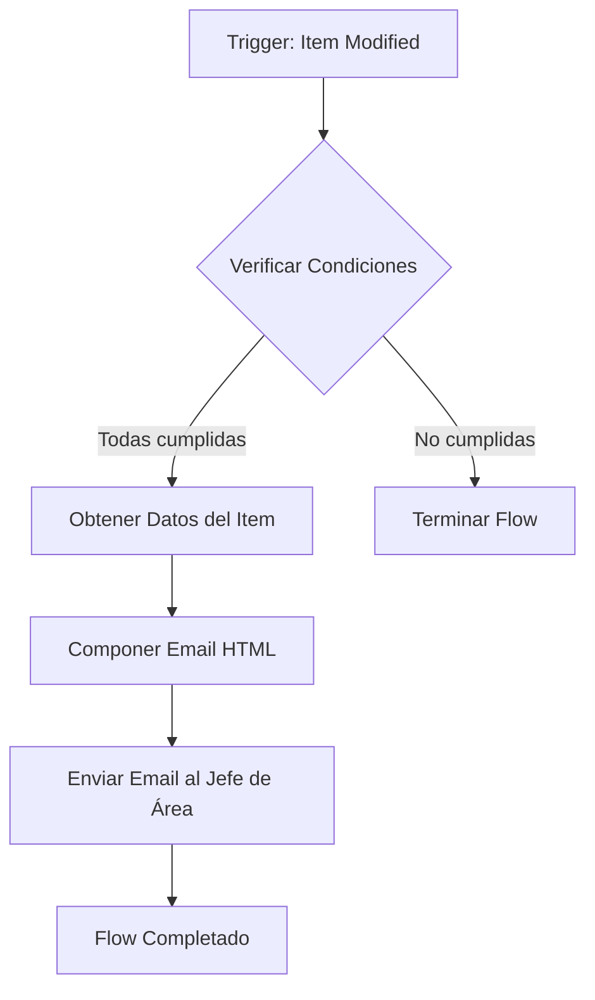
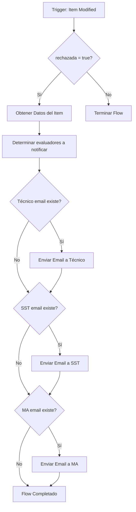

# Power Automate - Email Notifications Flow

## Descripción General

Este documento describe los flujos de Power Automate para enviar notificaciones por correo electrónico en el sistema de Evaluación de Proveedores A006.

---

## Flow 1: Notificación al Aprobador (Approver Reminder)

### 🎯 Objetivo
Enviar email automático al **Jefe de Área (Aprobador)** cuando todas las evaluaciones están completas y listas para aprobación.

### 🔔 Trigger
**When an item is created or modified** (SharePoint - ongoingEvaluations)

### ✅ Condiciones de Ejecución

El flow debe ejecutarse cuando se cumplen **TODAS** estas condiciones:

```
tecnico_submitted = true
AND
sst_submitted = true
AND
ma_submitted = true
AND
aprobada = false
AND
rechazada = false
```

### 📋 Lógica del Flow



### 🔧 Pasos Detallados del Flow

#### 1. **Trigger**
- **Action**: When an item is created or modified
- **List**: ongoingEvaluations

#### 2. **Condition - Verificar si está listo para aprobación**
```
@and(
  @and(
    @and(
      @equals(triggerOutputs()?['body/tecnico_submitted'], true),
      @equals(triggerOutputs()?['body/sst_submitted'], true)
    ),
    @equals(triggerOutputs()?['body/ma_submitted'], true)
  ),
  @and(
    @equals(triggerOutputs()?['body/aprobada'], false),
    @equals(triggerOutputs()?['body/rechazada'], false)
  )
)
```

#### 3. **Compose - Leer HTML Template**
- **Action**: Compose
- **Inputs**: 
  ```html
  <!DOCTYPE html>
  <html>
  <head>
      <meta charset="UTF-8">
  </head>
  <body style="font-family: Arial, sans-serif; color: #333333; line-height: 1.6;">
      <p><strong>Estimado/a @{triggerOutputs()?['body/nombre_jefe_area']},</strong></p>
      
      <p>Le recordamos que tiene una <strong>evaluación de proveedor pendiente de aprobación</strong>.</p>
      
      <h3 style="color: #003087;">📋 INFORMACIÓN DE LA EVALUACIÓN:</h3>
      
      <table style="border-collapse: collapse; width: 100%; max-width: 600px; margin: 20px 0;">
          <tr style="background-color: #f2f2f2;">
              <td style="padding: 10px; border: 1px solid #ddd;"><strong>Proveedor</strong></td>
              <td style="padding: 10px; border: 1px solid #ddd;">@{triggerOutputs()?['body/nombre_proveedor']}</td>
          </tr>
          <tr>
              <td style="padding: 10px; border: 1px solid #ddd;"><strong>Documento</strong></td>
              <td style="padding: 10px; border: 1px solid #ddd;">@{triggerOutputs()?['body/documento_compras']}</td>
          </tr>
          <tr style="background-color: #f2f2f2;">
              <td style="padding: 10px; border: 1px solid #ddd;"><strong>Fecha Evaluación</strong></td>
              <td style="padding: 10px; border: 1px solid #ddd;">@{formatDateTime(triggerOutputs()?['body/fecha_evaluacion'], 'dd/MM/yyyy')}</td>
          </tr>
          <tr>
              <td style="padding: 10px; border: 1px solid #ddd;"><strong>Puntaje Total</strong></td>
              <td style="padding: 10px; border: 1px solid #ddd;">@{triggerOutputs()?['body/puntaje_total']}</td>
          </tr>
          <tr style="background-color: #f2f2f2;">
              <td style="padding: 10px; border: 1px solid #ddd;"><strong>Responsable Técnico</strong></td>
              <td style="padding: 10px; border: 1px solid #ddd;">@{triggerOutputs()?['body/nombre_responsable_tecnico']}</td>
          </tr>
      </table>
      
      <h3 style="color: #003087;">✅ ACCIÓN REQUERIDA:</h3>
      
      <p style="font-style: italic; color: #666;">Por favor, revise los criterios evaluados y proceda con la aprobación o rechazo según corresponda.</p>
      
  </body>
  </html>
  ```

#### 4. **Send an email (V2)**
- **To**: `@{triggerOutputs()?['body/email_jefe_area']}`
- **Subject**: `🔔 Recordatorio: Aprobación de Evaluación Pendiente - @{triggerOutputs()?['body/nombre_proveedor']}`
- **Body**: `@{outputs('Compose_-_Email_Body_HTML')}`
- **Is HTML**: Yes

---

## Flow 2: Notificación de Rechazo a Evaluadores (Rejection Notification)

### 🎯 Objetivo
Enviar email automático a los **Evaluadores (Técnico, SST, MA)** cuando una evaluación es rechazada por el Jefe de Área.

### 🔔 Trigger
**When an item is created or modified** (SharePoint - ongoingEvaluations)

### ✅ Condiciones de Ejecución

El flow debe ejecutarse cuando:

```
rechazada = true
```

### 📋 Lógica del Flow



### 🔧 Pasos Detallados del Flow

#### 1. **Trigger**
- **Action**: When an item is created or modified
- **List**: ongoingEvaluations

#### 2. **Condition - Verificar si fue rechazada**
```
@equals(triggerOutputs()?['body/rechazada'], true)
```

#### 3. **Parallel Branches - Enviar emails a múltiples evaluadores**

Se deben crear **3 branches paralelos** para enviar emails a:
- Técnico (siempre)
- SST (si `responsable_sst_responde = true`)
- MA (si `responsable_ma_responde = true`)

##### Branch 1: Email al Responsable Técnico

**Condition**: 
```
@not(empty(triggerOutputs()?['body/email_responsable_tecnico']))
```

**Compose - Email Body HTML**:
```html
<!DOCTYPE html>
<html>
<head>
    <meta charset="UTF-8">
</head>
<body style="font-family: Arial, sans-serif; color: #333333; line-height: 1.6;">
    <p><strong>Estimado/a @{triggerOutputs()?['body/nombre_responsable_tecnico']},</strong></p>
    
    <p>Le informamos que la evaluación del proveedor ha sido <strong style="color: #d9534f;">RECHAZADA</strong> por el Jefe de Área.</p>
    
    <h3 style="color: #003087;">📋 INFORMACIÓN DE LA EVALUACIÓN:</h3>
    
    <table style="border-collapse: collapse; width: 100%; max-width: 600px; margin: 20px 0;">
        <tr style="background-color: #f2f2f2;">
            <td style="padding: 10px; border: 1px solid #ddd;"><strong>Proveedor</strong></td>
            <td style="padding: 10px; border: 1px solid #ddd;">@{triggerOutputs()?['body/nombre_proveedor']}</td>
        </tr>
        <tr>
            <td style="padding: 10px; border: 1px solid #ddd;"><strong>Documento</strong></td>
            <td style="padding: 10px; border: 1px solid #ddd;">@{triggerOutputs()?['body/documento_compras']}</td>
        </tr>
        <tr style="background-color: #f2f2f2;">
            <td style="padding: 10px; border: 1px solid #ddd;"><strong>Fecha Evaluación</strong></td>
            <td style="padding: 10px; border: 1px solid #ddd;">@{formatDateTime(triggerOutputs()?['body/fecha_evaluacion'], 'dd/MM/yyyy')}</td>
        </tr>
        <tr>
            <td style="padding: 10px; border: 1px solid #ddd;"><strong>Su Rol</strong></td>
            <td style="padding: 10px; border: 1px solid #ddd;">Técnico</td>
        </tr>
    </table>
    
    <h3 style="color: #d9534f;">⚠️ ACCIÓN REQUERIDA:</h3>
    
    <p><strong>Observaciones del Jefe de Área:</strong></p>
    <p style="background-color: #f9f9f9; padding: 15px; border-left: 4px solid #d9534f;">
        @{triggerOutputs()?['body/observaciones_jefe_area']}
    </p>
    
    <p>Por favor, revise las observaciones y realice las correcciones necesarias antes de volver a enviar la evaluación.</p>
    
</body>
</html>
```

**Send an email (V2)**:
- **To**: `@{triggerOutputs()?['body/email_responsable_tecnico']}`
- **Subject**: `⚠️ Evaluación Rechazada - Corrección Requerida - @{triggerOutputs()?['body/nombre_proveedor']}`
- **Body**: `@{outputs('Compose_-_Email_Tecnico')}`
- **Is HTML**: Yes

##### Branch 2: Email al Responsable SST

**Condition**: 
```
@and(
  @equals(triggerOutputs()?['body/responsable_sst_responde'], true),
  @not(empty(triggerOutputs()?['body/email_responsable_sst']))
)
```

> Usar el mismo template HTML pero:
> - Cambiar "Su Rol" a "SST"
> - Cambiar destinatario a `email_responsable_sst`
> - Cambiar nombre a `nombre_responsable_sst`

##### Branch 3: Email al Responsable MA

**Condition**: 
```
@and(
  @equals(triggerOutputs()?['body/responsable_ma_responde'], true),
  @not(empty(triggerOutputs()?['body/email_responsable_ma']))
)
```

> Usar el mismo template HTML pero:
> - Cambiar "Su Rol" a "MA"
> - Cambiar destinatario a `email_responsable_ma`
> - Cambiar nombre a `nombre_responsable_ma`

---

## 📝 Notas Importantes

### Consideraciones de Implementación

1. **Evitar Emails Duplicados**:
   - Agregar una columna en SharePoint: `notificacion_aprobador_enviada` (Boolean)
   - Agregar una columna: `notificacion_rechazo_enviada` (Boolean)
   - Actualizar estas columnas después de enviar emails
   - Agregar condición en el flow para verificar estas columnas

2. **Optimización del Trigger**:
   - Configurar **Filter Queries** en el trigger para reducir ejecuciones innecesarias
   - Flow 1 Filter: `aprobada eq false and rechazada eq false`
   - Flow 2 Filter: `rechazada eq true`

3. **Manejo de Errores**:
   - Configurar **Run after** settings para continuar si falla el envío a un evaluador
   - Agregar **Scope** actions para mejor tracking de errores
   - Configurar **Configure run after** en parallel branches

4. **Testing**:
   - Crear evaluaciones de prueba en SharePoint
   - Verificar que los emails se envían correctamente
   - Validar formato HTML en diferentes clientes de email
   - Probar escenarios con SST/MA flags en true/false

### Variables de SharePoint Necesarias

Para Flow 1 (Approver Reminder):
- `tecnico_submitted`
- `sst_submitted`
- `ma_submitted`
- `aprobada`
- `rechazada`
- `email_jefe_area`
- `nombre_jefe_area`
- `nombre_proveedor`
- `documento_compras`
- `fecha_evaluacion`
- `puntaje_total`
- `nombre_responsable_tecnico`

Para Flow 2 (Rejection Notification):
- `rechazada`
- `observaciones_jefe_area`
- `email_responsable_tecnico`
- `nombre_responsable_tecnico`
- `email_responsable_sst`
- `nombre_responsable_sst`
- `responsable_sst_responde`
- `email_responsable_ma`
- `nombre_responsable_ma`
- `responsable_ma_responde`
- `nombre_proveedor`
- `documento_compras`
- `fecha_evaluacion`

---

## 🔄 Mejoras Futuras (Opcional)

1. **Recordatorios Programados**:
   - Crear un flow separado con trigger **Recurrence** (diario)
   - Buscar evaluaciones pendientes de aprobación por más de X días
   - Enviar recordatorios automáticos

2. **Escalación**:
   - Si no hay aprobación después de 3 días, escalar al superior del Jefe de Área

3. **Dashboard de Notifications**:
   - Registrar todos los emails enviados en una lista separada
   - Tracking de tasas de respuesta

4. **Plantillas Dinámicas**:
   - Almacenar templates HTML en SharePoint
   - Permitir personalización sin modificar el flow
